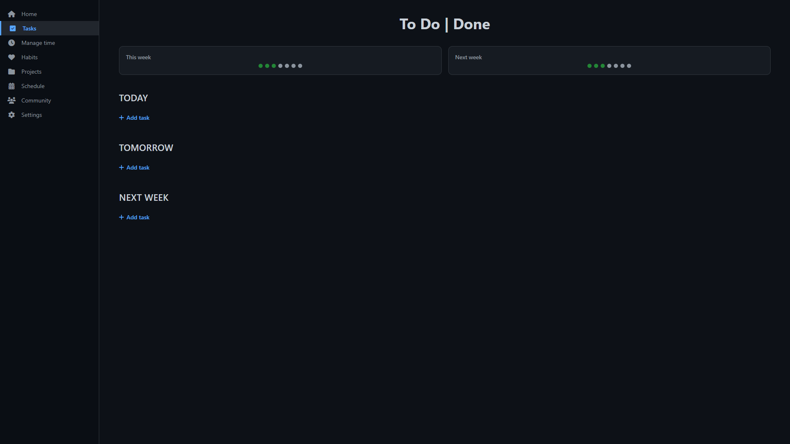
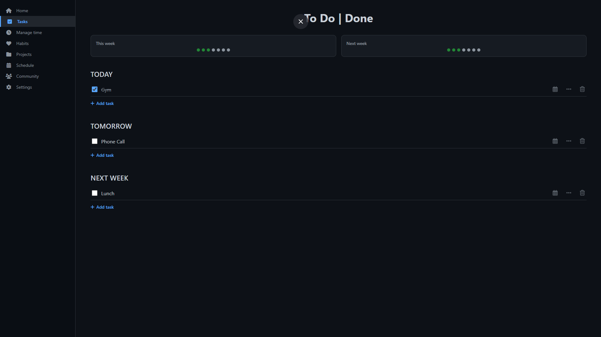

# Task Manager

A clean, dark-themed task manager with categories **TODAY / TOMORROW / NEXT WEEK**, checkboxes, drag-and-drop reordering, inline editing, deletion, and browser localStorage persistence.

## Screenshots

<div align="center">
  <p><strong>Main View</strong></p>
  
  
  <p><strong>Completed Tasks</strong></p>
  
</div>

## Features

- Dark modern UI with sidebar navigation  
- Task categories: TODAY, TOMORROW, NEXT WEEK  
- Progress overview for "This week" and "Next week" with dots  
- Inline task creation (Enter to add next, Escape/Blur to finish)  
- Checkboxes with strikethrough for completed tasks  
- Double-click to edit task names  
- Delete tasks  
- Drag-and-drop to reorder or move tasks between days  
- Automatic cleanup of completed tasks older than one week  
- All data saved in browser localStorage (no backend needed)

## How to Run

1. Install Python 3.8+ → https://www.python.org  
2. Navigate to the project folder:

   ```bash
   cd task_manager/app

## Project Structure
task_manager/
├── app/
│   ├── main.py              # Flask server
│   └── static/
│       ├── index.html       # Main page
│       ├── styles.css       # Dark theme styles
│       └── app.js           # Logic: tasks, drag-and-drop, localStorage

1. Copy the entire `task_manager` folder  
2. Install Python (3.8+)  
3. Install dependencies:
   
   ```bash
   pip install flask flask-cors

Run the server:Bashcd app
python main.py
Open in browser: http://127.0.0.1:5000

Tech Stack

Backend: Flask (Python)
Frontend: HTML + CSS + Vanilla JavaScript
Drag-and-drop: SortableJS (CDN)
Icons: Font Awesome (CDN)

License
MIT License — feel free to use, modify, and share.
Made with ❤️ by uvacode
